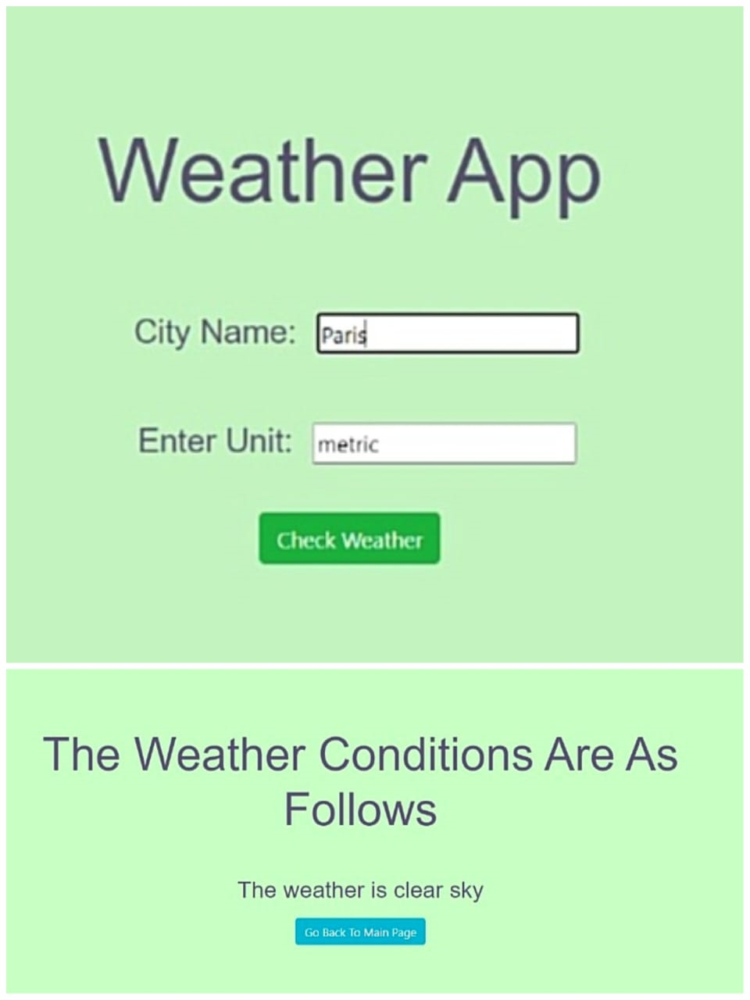

# Weather App

A simple web application that provides real-time weather information based on user location or search query. Built with HTML, CSS, JavaScript, and integrated with a weather API.



## Table of Contents

- [Introduction](#introduction)
- [Features](#features)
- [Technologies Used](#technologies-used)
- [Getting Started](#getting-started)
- [How to Use](#how-to-use)
- [API Integration](#api-integration)
- [Contributing](#contributing)
- [License](#license)

## Introduction

The Weather App is a user-friendly tool for accessing up-to-date weather data for any location. It provides current weather conditions, temperature, and more, making it a valuable resource for travelers and weather enthusiasts.

## Features

- Real-time weather data retrieval using a weather API.
- Location-based weather information.
- Search functionality for weather updates in specific locations.
- Display of current weather conditions, temperature, humidity, and wind speed.
- Responsive and visually appealing design.

## Technologies Used

- HTML
- CSS
- JavaScript
- Weather API (e.g., OpenWeatherMap)

## Getting Started

To run this Weather App locally, follow these steps:

1. Clone this repository:
   ```bash
   git clone https://github.com/yourusername/weather-app.git
2. Navigate to the project directory:
   cd weather-app
3. Open the index.html file in your web browser.
4. Start using the Weather App to check weather conditions.

## How to Use

- Open the Weather App in your web browser.
- By default, it will attempt to access your location for weather data.
- Alternatively, you can search for weather information in a specific location by entering the location in the search bar and clicking "Search."
- The app will display current weather conditions, temperature, humidity, and wind speed for the selected location.

## API Integration

This project integrates with a weather API (e.g., OpenWeatherMap). To use the API, you need to obtain an API key, which should be placed in the config.js file.
      // config.js
      const apiKey = 'YOUR_API_KEY_HERE';
      
      // Export the API key
      export default apiKey;

      Replace 'YOUR_API_KEY_HERE' with your actual API key
      
## Contributing
Contributions are welcome! If you'd like to contribute to this project, please follow these guidelines:

1. Fork the repository.
2. Create a new branch for your feature: git checkout -b feature-name
3. Commit your changes: git commit -m 'Add new feature'
4. Push to your branch: git push origin feature-name
5. Submit a pull request.

## License
This project is licensed under the MIT License - see the LICENSE file for details.

